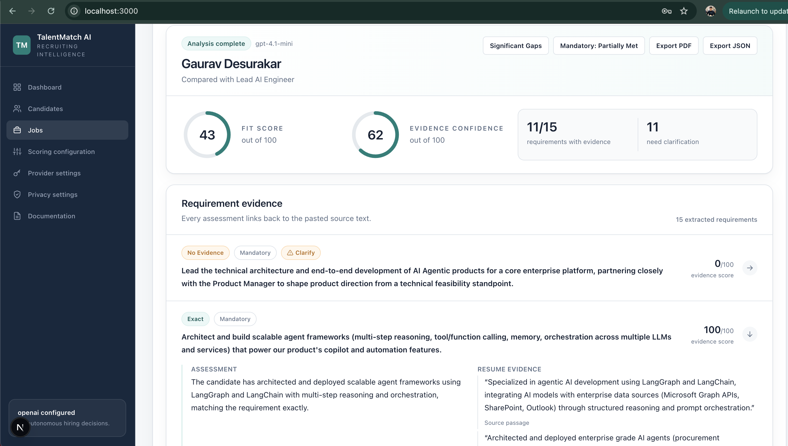

# TalentMatch AI

TalentMatch AI is an open-source, evidence-based resume-to-job assessment workspace for HR teams. Recruiters create a job, approve its scorecard, assess candidates in batches, inspect verbatim resume evidence, and record a human-controlled next action.

The language model structures requirements and evidence. Application code validates the output and calculates scores deterministically. The product does not automatically rank, shortlist, or reject candidates.

> TalentMatch AI provides decision support only. Never use a score or system suggestion as the sole basis for an employment decision.

## Business challenge

Recruiting teams often need to review many resumes against complex job requirements while working under time pressure. Manual review can be slow and inconsistent, conventional keyword filters can miss relevant transferable evidence, and opaque automation can produce scores without showing recruiters how they were derived. This makes it difficult to apply the same job-related criteria consistently, explain an assessment, identify missing information, and retain human accountability for the final decision.

Teams therefore need a practical way to scale initial resume assessment without turning an automated score into a hiring decision or losing sight of the evidence, uncertainty, privacy, and governance requirements behind each assessment.

## How TalentMatch AI addresses it

- **Review criteria before candidates:** Convert the job description into a source-grounded scorecard that a recruiter reviews and approves before candidate analysis.
- **Connect assessments to evidence:** Link every evaluated requirement to verbatim resume evidence, or clearly report when supporting evidence was not found.
- **Keep scoring transparent:** Structure provider output, validate it, and calculate fit and evidence-confidence scores deterministically in application code.
- **Surface uncertainty:** Separate mandatory status, evidence gaps, clarification flags, and interview questions from the overall fit score.
- **Preserve human control:** Keep results in submission order, avoid automatic ranking, and require recruiters to record the next action and its job-related rationale.
- **Support different operating environments:** Run locally with the deterministic mock provider or connect an approved external provider with explicit document-transmission confirmation.

## See it in action

[](docs/assets/app-demo.mp4)

Select the screenshot or [watch the full product demo](docs/assets/app-demo.mp4) to see the workflow from job setup through evidence review and a recruiter-controlled next action.

## Current capabilities

- Jobs-centred workflow from job description to approved scorecard and candidate analysis.
- Candidate profiles with resume versions and chronological role history.
- PDF, DOCX, and UTF-8 TXT resume extraction with source references and warnings.
- Multi-candidate analysis that preserves upload order and does not create a ranking.
- Verbatim evidence, fit score, evidence-confidence score, mandatory status, clarification flags, and interview questions.
- Manual recruiter statuses, job-related reasons, notes, ownership, and status history.
- Contextual PDF, JSON, and CSV exports.
- Deterministic local mock provider plus optional OpenAI, Anthropic, Google Gemini, Groq, OpenAI-compatible, and Ollama adapters.
- SQLite persistence, retention controls, delete workflows, background progress, and schema-validated provider output.

The mock provider requires no key or network access and is intended for development and demonstration. Validate any external provider with your organisation before processing personal data.

## Upcoming features

The [feature roadmap](docs/roadmap.md) contains contributor-ready ideas across enterprise readiness, recruiting workflows, integrations, document processing, assessment quality, governance, and platform operations. These items are proposals rather than delivery commitments.

Contributors are welcome to select an item, check for related issues or pull requests, and open an issue to agree on scope before implementation. See the [contribution guide](CONTRIBUTING.md) for engineering expectations and validation requirements.

## Quick start

Requirements: [uv](https://docs.astral.sh/uv/getting-started/installation/), Python 3.11+, Node.js 20+, and npm 10+. CI and the API container use Python 3.12; `uv` manages the local API environment.

```bash
make install
make db-upgrade
make dev
```

Then open <http://localhost:3000>. The API and OpenAPI documentation run at <http://localhost:8000> and <http://localhost:8000/docs>.

Python dependencies are resolved in `apps/api/uv.lock` and installed into `apps/api/.venv`. Use `uv lock --project apps/api --upgrade` when intentionally upgrading them.

No `.env` file is required for the local mock. For local API configuration, copy `.env.example` to `apps/api/.env`; the API loads that file because `make api-dev` runs from `apps/api`. For Docker Compose, place overrides and optional system provider keys in the root `.env`, which Compose reads automatically. Keys entered through the Provider settings page do not require `OPENAI_API_KEY` or another key in an `.env` file.

The local SQLite database is created as `apps/api/talentmatch.db`. Docker Compose stores it in the `talentmatch-data` volume.

To run services separately:

```bash
make api-dev
make web-dev
```

## Tests and checks

```bash
make test
make lint
```

`make test` enforces at least 90% backend coverage. `make lint` runs Ruff, mypy, ESLint, and strict TypeScript checks, including unused local and parameter detection.

## Docker Compose

```bash
docker compose up --build
```

## Security and privacy

The default `mock` provider makes no network calls and requires no API key. Keys entered in Provider settings are kept in an expiring API-process memory session; only a masked value and opaque session identifier return to the browser. External providers receive documents only after the user reviews the transmission notice and explicitly approves analysis. Do not use real candidate data in issues or repository fixtures.

The MVP has no authentication and is intended for a trusted, single-user local environment. Do not expose it directly to an untrusted network. Review [Data privacy](docs/privacy.md), [Threat model](docs/threat-model.md), and [Security policy](SECURITY.md) before deployment.

## Documentation

- [HR user guide](docs/hr-user-guide.md)
- [Product requirements](docs/product-requirements.md)
- [Architecture](docs/architecture.md)
- [Scoring methodology](docs/scoring-methodology.md)
- [Document ingestion](docs/document-ingestion.md)
- [Provider integration](docs/provider-integration.md)
- [API reference](docs/api.md)
- [Data privacy](docs/privacy.md)
- [Threat model](docs/threat-model.md)
- [Feature roadmap](docs/roadmap.md)
- [Implementation plan](IMPLEMENTATION_PLAN.md)
- [Contributing](CONTRIBUTING.md)
- [Changelog](CHANGELOG.md)

Licensed under Apache License 2.0.
