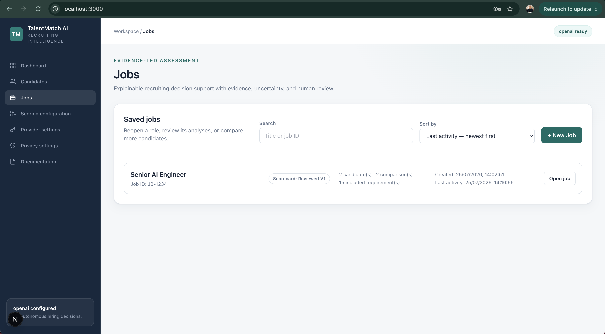

# HR user guide

This guide explains how recruiters and HR teams should use TalentMatch AI from job setup through a human-controlled next action.

> TalentMatch AI is decision support. It does not verify whether resume claims are true, rank candidates automatically, or make hiring and rejection decisions.

## See the workflow

Select the screenshot or [watch the product demo](assets/app-demo.mp4) for a visual walkthrough of the workflow described in this guide.

## Before you begin

Confirm that:

- your organisation is permitted to process the job and candidate information;
- the retention period and external-provider use follow your internal policies;
- the job criteria are job-related and do not use protected or inferred demographic characteristics;
- a recruiter will review evidence before taking action; and
- the application is running in a trusted environment. The MVP has no user authentication.

Use the local mock only for product evaluation with fictional data. It is deterministic and network-free, but it is not suitable for real hiring support.

## Product navigation

| Page                  | Use it for                                                                                                                |
| --------------------- | ------------------------------------------------------------------------------------------------------------------------- |
| Dashboard             | Start a new job and see aggregate or recent activity.                                                                     |
| Jobs                  | Create roles, approve scorecards, analyse candidates, review evidence, record HR actions, and export job-related records. |
| Candidates            | Find saved candidates, manage resume versions, compare a candidate with an approved role, and review role history.        |
| Scoring configuration | Set category weights, the skill taxonomy, and triage defaults for newly created jobs.                                     |
| Provider settings     | Select a model provider, create an expiring credential session, and test the connection.                                  |
| Privacy settings      | Save the retention period or permanently delete all application data.                                                     |
| Documentation         | Open the interactive API documentation and review product safeguards.                                                     |

Jobs is the normal starting point for a vacancy. Candidates is useful when an existing candidate should be considered for another approved role.

## 1. Configure the provider

Open **Provider settings** before processing candidate information.

1. Choose a provider.
2. Confirm or edit the model name.
3. For an external provider, enter the API key. For an OpenAI-compatible endpoint or Ollama, also check the base URL.
4. Select **Save session**.
5. Select **Test connection**.

A successful connection test validates the configured provider without transmitting candidate documents. It does not guarantee that every later request will succeed; model access, quotas, rate limits, output validity, and session expiry can still affect an analysis.

Keys entered in the UI remain in an expiring API-process memory session. The browser keeps only the opaque session details in `sessionStorage`. If the API restarts, the session expires, or **Remove key** is selected, save a new provider session before analysing again.

The selected external provider receives:

- the job description when generating or regenerating the scorecard; and
- the approved job criteria and selected resumes when running candidate analysis.

The UI displays a transmission notice before each operation.

## 2. Review scoring and triage defaults

Open **Scoring configuration** when organisational defaults need to change.

- Category weights must be non-negative and total exactly 100.
- The skill taxonomy must be a valid JSON array.
- Default fit and evidence-confidence thresholds are copied into newly created jobs.
- Existing jobs keep their own versioned triage policy when global defaults change.

Thresholds generate a non-binding suggestion only. They do not update HR status or take an automatic action.

## 3. Create a job

From the Dashboard or Jobs page, select **New Job**.

1. Enter the job title.
2. Enter the company's job or requisition ID when available. This is optional but makes the role easier to find.
3. Paste the complete job description.
4. Select **Create job and continue**.

Saved jobs can be searched by title or job ID and sorted by creation date or last activity.

Use a job description that separates genuine mandatory criteria from preferences. Do not include age, race, nationality, religion, sex, gender identity, disability, marital status, family status, or another protected characteristic as a scoring criterion. Review location, language, education, and career-history requirements for indirect or unnecessary exclusion.

## 4. Generate and approve the scorecard

Open **Requirements and Scoring** in the job workspace.

1. Select **Generate** or **Regenerate** with the configured provider.
2. Review every extracted requirement against the source job description.
3. Include or exclude each requirement.
4. Correct its classification, category, and importance where necessary.
5. Save a draft if another reviewer must check it.
6. Select **Approve scorecard** only when the criteria are ready to govern comparisons.

Candidate resumes are not used to generate the scorecard. This prevents criteria from being changed to favour a particular applicant.

Editing the saved job description invalidates the prior approval. Regenerate, review, and approve the new scorecard before analysing more candidates. Historical results retain the scorecard version used at the time.

## 5. Set the job triage policy

Open **Recruiter Triage Policy** in the job workspace.

Configure:

- minimum fit score;
- minimum evidence-confidence score;
- whether mandatory requirements must be met; and
- whether clarification flags must be absent.

Save the policy before relying on its suggestion. The policy is versioned. A suggestion such as **Meets shortlist threshold**, **Needs clarification**, **Mandatory concern**, or **Below threshold** supports review but never changes the recruiter-controlled status.

## 6. Add resumes and find talent

Open **Find Talent** after the scorecard is approved.

1. Upload PDF, DOCX, or UTF-8 TXT resumes, or add resume text manually.
2. Review the extracted text, source sections, candidate display name, confidence, and warnings.
3. Correct extraction problems before analysis.
4. Enable **Blind-review display** when neutral labels are appropriate for the review process.
5. Read the provider transmission notice.
6. Select **Approve this analysis**.
7. Select **Find Talent**.

The system rejects duplicate resume content within the job and a resume that duplicates the job description. Scanned PDFs without a usable text layer require external OCR before upload.

Results stay in upload order. A higher position in the list does not mean a higher assessment or recommendation.

## 7. Review a candidate's evidence

Select **View evidence** for a candidate. Review the whole record, not only the fit score.

| Result               | Interpretation                                                                                                     |
| -------------------- | ------------------------------------------------------------------------------------------------------------------ |
| Fit score            | Deterministic alignment between the approved criteria and structured evidence. It is not a hiring probability.     |
| Evidence confidence  | Coverage and source linkage of available resume evidence. It is not a truthfulness or credibility score.           |
| Mandatory status     | Separate result showing whether mandatory criteria are evidenced, partly evidenced, unresolved, or not applicable. |
| Requirement evidence | Verbatim resume excerpts associated with each approved requirement.                                                |
| Clarification points | Information that should be checked with the candidate or another reliable source.                                  |
| Interview questions  | Suggested questions tied to evidence gaps or requirements.                                                         |
| Triage suggestion    | Deterministic application of the job policy. It is not an HR decision.                                             |

For every material decision:

- verify that the quoted evidence supports the stated requirement;
- treat **No evidence found** as missing resume evidence, not proof that the candidate lacks the capability;
- investigate extraction warnings and clarification flags;
- apply the same job-related criteria consistently to every candidate;
- use interviews, references, work samples, and other approved processes where appropriate; and
- document the recruiter's independent rationale.

## 8. Record the recruiter action

The evidence view provides quick actions and a full HR status selector. Available statuses include New, Under review, Needs clarification, Shortlisted, interview stages, On hold, Talent pool, Not progressing, Withdrawn, Offer, and Hired.

1. Choose the appropriate status.
2. Assign a recruiter or team if needed.
3. Add a concise, job-related note.
4. For **Not progressing**, select a job-related reason. The **Other** reason requires a note.
5. Select **Save recruiter action**.

Use **Not progressing** rather than an unexplained rejection label. Do not record protected characteristics, medical information, speculation, or irrelevant personal details in recruiter notes. Saved actions retain a status timeline plus the triage suggestion and policy version visible at the time.

## 9. Use the Candidates workspace

Candidate records created through analysis appear in **Candidates**.

You can:

- search by candidate name;
- filter by whether a candidate has prior analyses;
- sort by last activity, date added, or name;
- upload a new, non-duplicate resume version;
- compare a selected resume version with any approved job; and
- review chronological role history and evidence.

Comparing from Candidates still requires explicit approval of document transmission. If no job appears in the Approved job list, approve that job's scorecard first.

## 10. Export records

Within **Candidate Analyses** on a job or **Role History and Evidence** on a candidate:

1. Select one to five analyses with the **Export** checkbox.
2. Choose **Export selected CSV** or **Export selected JSON**.
3. Use **PDF report** for an individual analysis.

Exports contain personal and assessment data. Store, share, and delete them according to organisational policy. Exporting a file does not remove it when application data is deleted.

## 11. Retention and deletion

The **Privacy settings** page stores a retention period and provides **Delete all data**.

- Saving the retention period does not automatically run deletion. An operator must call the retention endpoint or configure a scheduler. A retention run deletes analyses older than the cutoff and job or candidate records that have no remaining analyses.
- Deleting a saved job removes that job and its linked analyses; candidate records remain.
- Deleting a candidate removes that candidate's resume versions and linked analyses; jobs remain.
- Delete all data removes saved jobs, candidates, resumes, comparisons, analysis runs, and audit events.
- Provider keys entered in the UI are already held only in API-process memory and should be removed separately when no longer needed.

Deletion is material and cannot be undone through the product. Confirm that required exports or lawful records are retained elsewhere before deletion.

## Troubleshooting

### The provider session is missing or expired

Return to **Provider settings**, enter or select the provider configuration, and select **Save session** again. This commonly occurs after the API restarts, the session expires, or browser state refers to an old session.

### Test connection succeeds but analysis fails

The connection test sends no candidate documents. Check model access, quota, rate limits, provider output errors, and whether the credential session expired after the test. The UI should display the provider-safe error message.

### The scorecard cannot be used

Confirm that it has at least one included requirement and has been approved. If the job description changed, regenerate and approve the scorecard again.

### A resume cannot be uploaded

Confirm that the file is PDF, DOCX, or UTF-8 TXT, is no larger than 10 MB, and contains extractable text. Review any warning for scanned PDFs, unsafe DOCX content, or duplicate text.

### Evidence is rejected or missing

The provider must return verbatim evidence found in the resume. Schema-invalid output after the bounded repair attempt stops the analysis. Unsupported evidence is discarded or converted to an explicit evidence gap instead of being fabricated. Retry only after checking the resume extraction, selected model, and provider compatibility.

## Recruiter completion checklist

Before moving a candidate forward or marking them Not progressing, confirm that:

- the approved scorecard contains only job-related criteria;
- the candidate was assessed against the correct scorecard version;
- extraction warnings and evidence gaps were reviewed;
- mandatory status and clarification flags were considered separately from fit;
- the recruiter made the decision rather than copying the system suggestion;
- the reason and note are factual, relevant, and non-discriminatory; and
- any export or retained data follows organisational privacy policy.
